  

<h3 align="center">¡Hola 👋! Soy Leonel Briones 👨🏻‍💻</h3>

  
  

  
  
  

  "Soy desarrollador web full stack con más de 2 años creando proyectos web funcionales y dinámicos. Me apasiona el desarrollo web, y disfruto programando y aprendiendo algo nuevo cada día."

## 🚀 Tecnologías y herramientas

- **Frontend**: React, TailwindCSS, HTML, CSS, JavaScript (ES6+)
- **Backend**: Node.js, Express, Python, Django
- **Bases de datos**: MySQL, PostgreSQL, SQLite
- **Herramientas**: Git, GitHub, VS Code, Notion, Figma

## 🌱 Actualmente aprendiendo

- Profundizando en **Electron** para aplicaciones de escritorio.
- Explorando nuevas herramientas y metodologías de **desarrollo web**.
- Explorando el desarrollo de aplicaciones móviles con **React Native**.

## 🛠 Proyectos destacados

- **[Proyecto](#)**: ....

## 📊 Métricas

